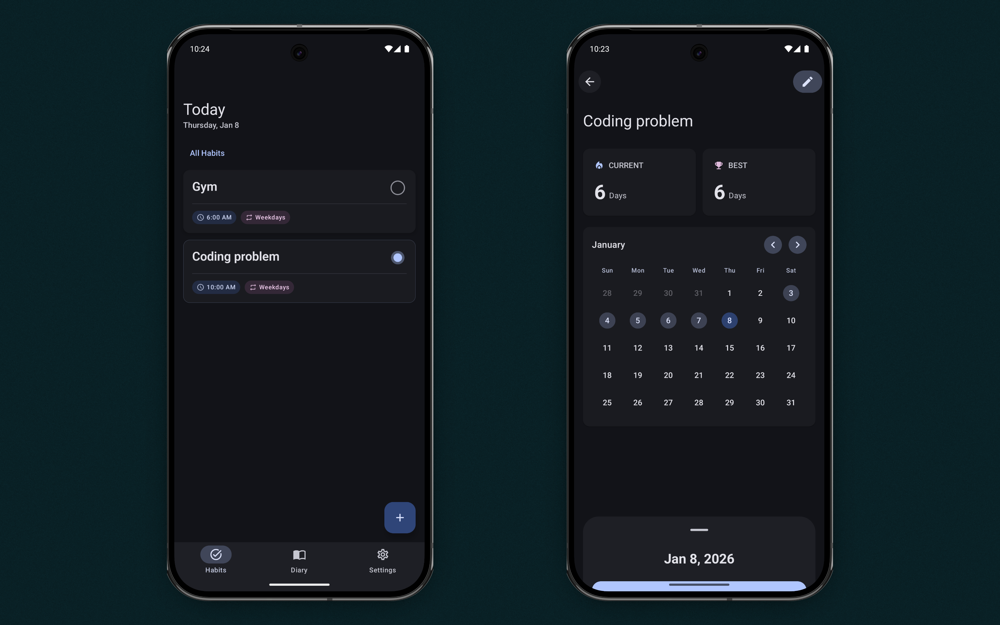
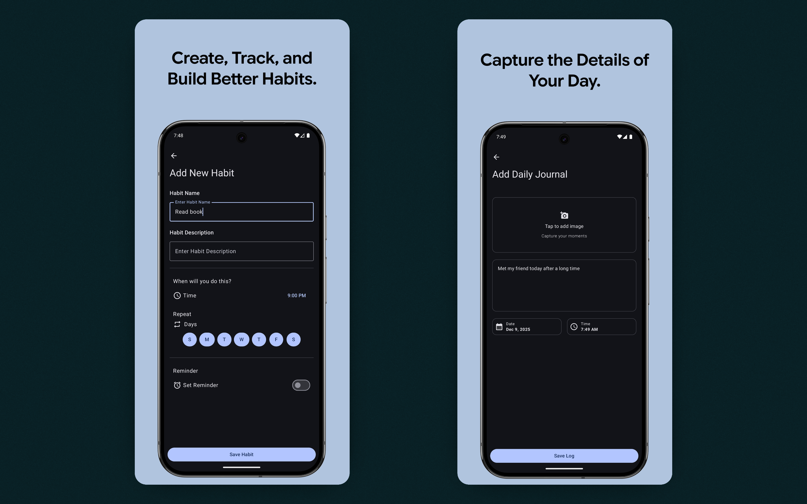

  

# Habit Diary

Habit Diary is an Android app that helps you track habits while capturing your daily life through photos, videos, and notes, all in one place.

  

## Habits

Habits are activities you want to build consistency with.

- Create habits with reminders
- When a habit is checked off, it is automatically added to the Daily Log for that day

## Daily Log

Daily Log works as a personal journal.

- Document your day with photos, videos, and notes.
- View your past entries directly from the calendar and revisit previous days.

## Features

- Habit tracking with reminders
- Daily logs with images and videos
- Calendar view
- Light and dark mode support

## Tech Stack

- Kotlin
- Jetpack Compose
- Room Database
- [Compose Calendar](https://github.com/kizitonwose/Calendar)

## Screenshots

  

 

  

